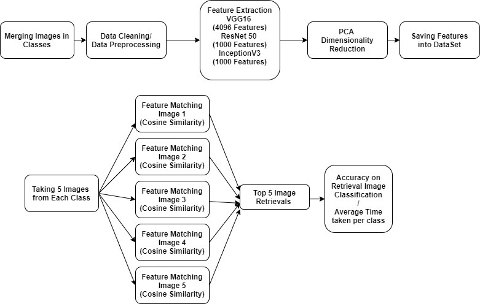
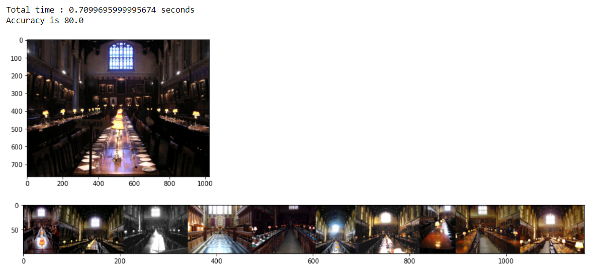
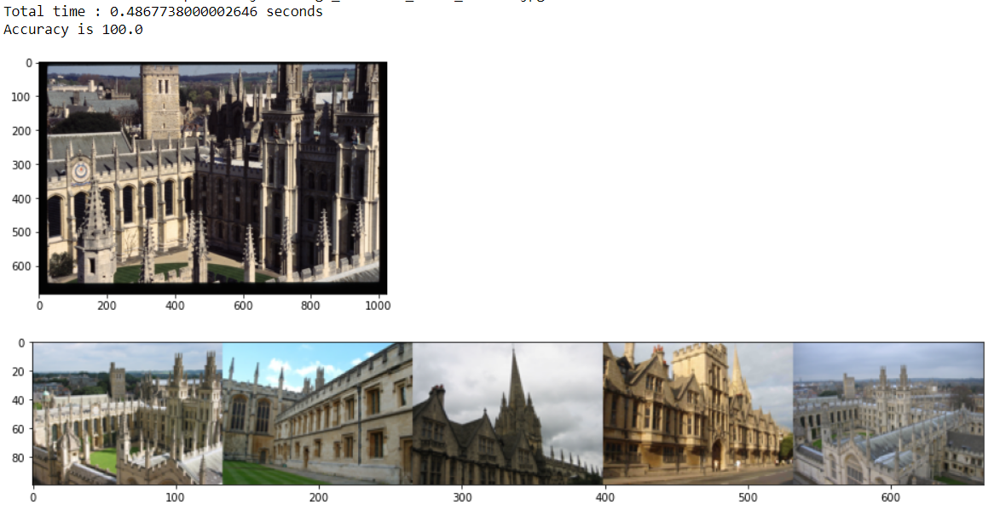
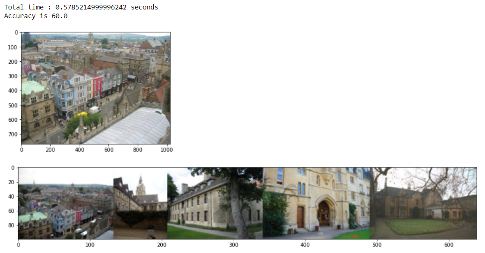

# Content-Based-Image-Retrieval
This repository contains a CBIR (content-based image retrieval) system
We have divided this Project in 2 Parts :
1. **IR_Project_Mid_Sem_Review** : Here we have Implemented a Content Based Image Retrieval System with the Help of Various Feature Detection Techniques like HOG,SIFT,SURF etc. We hve followed a Classification Approach for Input Query Image.
2. **IR_Project_CBIR** : Deep Learning Neural Networks are Used like VGG-16, ResNet50, InceptionV3 etc. to achieve Good Retrievals.
## Architecture :

## Dataset :
We have Used Oxford Buildings Dataset, CBIR Dataset and Paris Dataset.

## Results :
### Result 1.

###Result 2

### Result 3

## Folders :
1. **Presentation** : Contains Final Presentation for our Project Content Based Image Retrieval System.
2. **Report** : It contains Implemented Baseline Report and Final Project Report. 
3. **IR_Project_MidSem_Review** : Baseline Project Implementation.
4. **IR_Project_CBIR** : Final Implementation

## How to run?
Folder **IR_Project_CBIR** contains ReadMe, Go through it and get the Retrievals.

Authors :
This Project is done as a part of Information Retrieval Course.  
**Akhil Mahajan (MT20107), Anjali Jain (MT20082), Shradha Sabhlok (MT20069), Prabal Jain (MT20115)**
